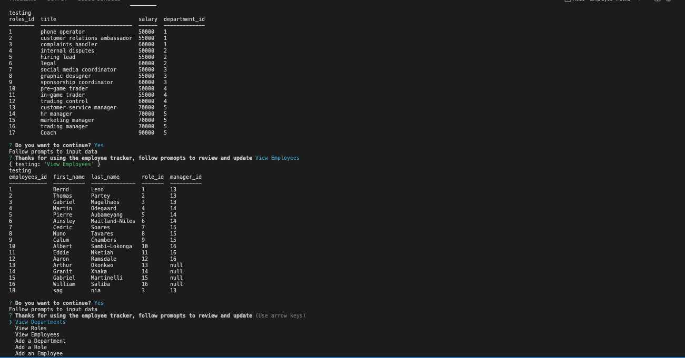

# Employee Tracker

## Table of Content 
* [Description](#description)
* [Technologies](#technologies)
* [Usage](#usage)
* [Contributing](#contributing)
* [Testing](#testing)
* [Questions](#questions)
* [License](#license)

## Description
This app is designed to display databases for a companies employees.  The content is viewable in table form using Mysql and is able to be updated through prompts in Node.

## Technologies
JavaScript, Node JS, Inquirer

## Usage

Once loaded, use the schema and seeds files to view the data displayed in this database or make updates later.  By using node index.js, users will be shown a range of prompts asking them to view database content or make additions to it. 

## Contributing
Project can be accesed here - https://github.com/konnenhannaford/Employee-Tracker

Repo is Public so freely available using MIT Licence. 

## Testing
No testing information as of yet

## Questions
Contact me if you have any queries:

Github UserName - konnenhannaford

Github Profile - https://github.com/konnenhannaford

Contact me for further info and any questions

Email - konnen23@gmail.com

## License
MIT license
Copyright 2021 Read Me Generator